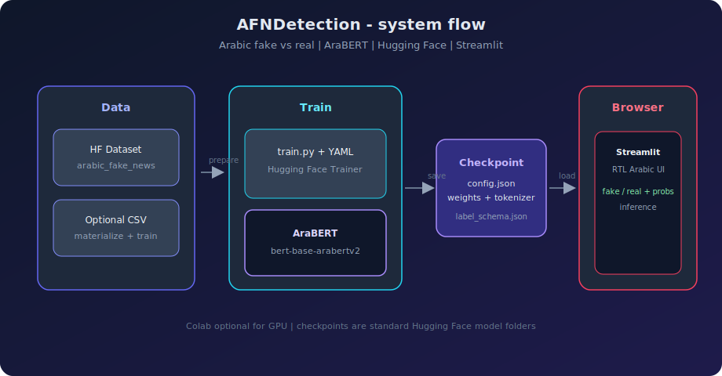
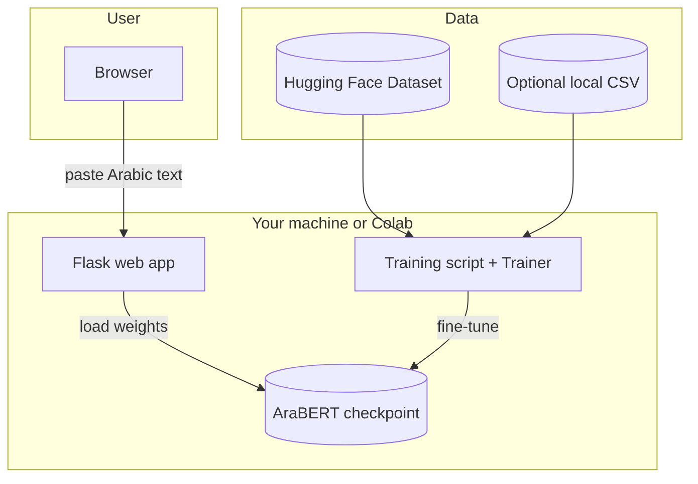
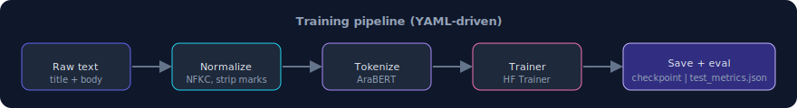
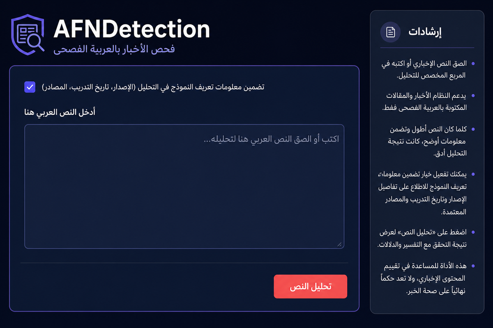

# 🛡️ AFNDetection — Arabic Fake News Detection

> **Modern Standard Arabic (MSA)** misinformation screening with a **fine-tuned AraBERT** transformer, **Hugging Face** tooling, and a **Flask + HTML/CSS/JS** web interface built for **RTL** Arabic.

[](https://www.python.org/)
[](https://pytorch.org/)
[](https://huggingface.co/docs/transformers)
[](https://flask.palletsprojects.com/)

AFNDetection bundles **training**, **evaluation**, and a **Flask-based web demo** in one Python codebase (**PyTorch** + **Hugging Face Transformers**).

---

## 🧐 Overview

AFNDetection classifies Arabic news-style text as **fake** or **real** (binary).

| | |
| --- | --- |
| **Model** | [`aubmindlab/bert-base-arabertv2`](https://huggingface.co/aubmindlab/bert-base-arabertv2) + sequence classification head |
| **Default data** | [`Nahla-yasmine/arabic_fake_news`](https://huggingface.co/datasets/Nahla-yasmine/arabic_fake_news) on the Hub |
| **Optional** | Curated CSV via `configs/train_arabic_curated.yaml` + `scripts/materialize_arabic_curated.py` |
| **UI** | [`app/streamlit_app.py`](app/streamlit_app.py) + `app/web/*` — Arabic labels (مزيف / حقيقي), probability bars, RTL-aware layout |
| **Python package** | Installable name **`fndarija`** (`src/fndarija/`); product name **AFNDetection** is used in docs and UI |

---

## 🏗️ System architecture

**Local-first:** train on your machine or in **Google Colab**; checkpoints are standard **Hugging Face** folders (`config.json`, weights, tokenizer). The **Flask** app loads a checkpoint and exposes a small `/api/predict` endpoint consumed by the frontend.

<p align="center">
  
</p>

<details>
<summary>Mermaid (same flow, text-editable)</summary>



</details>

### Core components (this repo)

* **Data layer** — Hugging Face **Datasets** (`datasets`) for the public Arabic corpus, or a **local CSV** when `local_path` is set and the file exists (see YAML). Optional `scripts/materialize_arabic_curated.py` builds that CSV.
* **Model layer** — **`AutoModelForSequenceClassification`** on **AraBERT**; labels **`fake` / `real`** (`id2label` / `label2id` in training).
* **Training** — **`transformers.Trainer`** with **`evaluate`** metrics (accuracy + binary F1), checkpointing to `training.output_dir`; tokenizer saved next to weights.
* **Inference** — **`fndarija.inference.predict`**: load tokenizer + model from a folder, softmax over two logits, map argmax to label string.
* **UI** — **Flask backend + vanilla frontend**: backend loads checkpoint from `configs/app.yaml` and frontend calls `/api/predict`.

### Training pipeline (conceptual)

<p align="center">
  
</p>

---

## ✨ Key features

- **Arabic-first UX** — RTL-aware web UI styling, Arabic result labels, and right-aligned input patterns.
- **Transformer baseline** — AraBERT fine-tuned with `transformers.Trainer`, not a bag-of-words baseline.
- **Reproducible configs** — YAML for dataset paths, hyperparameters, and checkpoint output.
- **Hub or file** — Pull the public dataset from Hugging Face or train on a materialized CSV.
- **Metrics on held-out test** — `test_metrics.json` after training; `label_schema.json` records label mapping and data source note.
- **Colab path** — [`notebooks/AFNDetection_Colab.ipynb`](notebooks/AFNDetection_Colab.ipynb) for GPU runs on Drive.

---

## Request & inference flow

End-to-end path from user to score (local demo):

1. **Browser** → user opens the web app, pastes Arabic text, then clicks analyze.
2. **Frontend** → sends the input text to **`POST /api/predict`**.
3. **Flask backend** → normalizes text (`normalize_arabic_text`), tokenizes, runs **`model(**inputs)`** on CPU or CUDA, and returns JSON.
4. **Response** → UI shows **مزيف / حقيقي** and per-class probabilities.

### Minimal Python inference (batch / script)

```python
from pathlib import Path
from fndarija.inference.predict import load_classifier, predict_text

ckpt = Path("checkpoints/arabic")
tok, model, device, _ = load_classifier(ckpt)
label, probs, _ = predict_text("نص الخبر هنا...", tok, model, device)
print(label, probs)
```

---

## Optional: “MLOps” & cloud deployment

This repo is deliberately **simple**: train with `scripts/train.py`, copy `checkpoints/` (or ZIP them), then run the Flask web app locally or on a VM.

| If you want… | Typical direction |
|--------------|------------------|
| Share UI quickly | Deploy Flask on **Render**, **Railway**, or any VPS with Python. |
| REST API + Docker | Wrap inference in **FastAPI**, containerize, deploy on **AWS App Runner**, **Cloud Run**, etc. |
| Managed GPU inference | [**Hugging Face Inference Endpoints**](https://huggingface.co/inference-endpoints) or **SageMaker** with a **PyTorch** container. |

Automated **GitHub Actions** for training or deployment are optional; add workflows only if you need them.

---

## 🎬 Web UI

<p align="center">
  
</p>

---

## 🛠️ Tech stack

### Machine learning & NLP


### App & tooling


---

## 🧠 Model training & evaluation

### Methodology

* **Splits** — Stratified **train / validation / test** (`val_ratio`, `test_ratio`, `seed` in YAML).
* **Text field** — `title_plus_text` (and related modes) from the loader; light **Unicode / diacritics / whitespace** normalization before BERT tokenization.
* **Optimization** — AdamW-style training via Trainer (`learning_rate`, `weight_decay`, `warmup_ratio`, epochs, batch sizes); best checkpoint optional via `metric_for_best_model` (e.g. **F1**).
* **Reporting** — **`test_metrics.json`** on the **held-out test** split after `trainer.evaluate`.

### Where to read metrics

After training, open the checkpoint directory (e.g. `checkpoints/arabic/`):

| Artifact | Contents |
|----------|----------|
| `test_metrics.json` | `eval_loss`, `eval_accuracy`, `eval_f1`, … (exact keys depend on `compute_metrics`) |
| `label_schema.json` | `id2label`, `label2id`, `source` note (Hub id or CSV path) |

We **do not** ship a fixed benchmark table in the README: numbers depend on your config, seed, and hardware. Run training once and cite your own `test_metrics.json` in reports.

---

## 📂 Project structure

```text
.
├── app/
│   ├── streamlit_app.py          # Flask backend (serves API + HTML)
│   └── web/
│       ├── templates/
│       │   └── index.html
│       └── static/
│           ├── css/style.css
│           └── js/app.js
├── configs/
│   ├── train_arabic.yaml          # Default: Hub dataset
│   ├── train_arabic_curated.yaml # Local CSV path
│   └── app.yaml                  # Web app checkpoint path
├── data/                         # Local data (gitignored heavy outputs as needed)
├── notebooks/
│   └── AFNDetection_Colab.ipynb  # GPU workflow on Colab / Drive
├── scripts/
│   ├── train.py                  # CLI training
│   ├── validate_datasets.py      # Hub connectivity checks
│   ├── prepare_parquet.py        # Optional Parquet export
│   └── materialize_arabic_curated.py
├── src/
│   └── fndarija/                 # Python package (pip install -e .)
│       ├── data/
│       ├── models/
│       ├── training/
│       └── inference/
├── tests/
│   └── test_preprocess.py
├── docs/
│   └── images/                  # README diagrams + UI mockups (SVG/PNG)
├── checkpoints/                  # Created after training (often gitignored)
├── requirements.txt
├── pyproject.toml
└── README.md
```

| Path | Role |
|------|------|
| `configs/*.yaml` | Single source of truth for data source, model id, training args |
| `src/fndarija/training/run.py` | `train_from_config()` — Dataset → tokenize → Trainer |
| `src/fndarija/inference/predict.py` | `load_classifier`, `predict_text` for batch scripts or Flask API |
| `docs/images/` | README figures: `architecture.svg`, `training-pipeline.svg`, `streamlit-ui-mockup.png` |
| `checkpoints/` | `config.json`, weights, `label_schema.json`, `test_metrics.json` |

---

## 🚀 Getting started

### Prerequisites

- **Python** ≥ 3.10  
- **GPU** recommended for full training (CPU okay for tiny `--max-samples` smoke tests)

### Environment

**Windows (PowerShell)**

```powershell
cd "path\to\AFNDetection"
python -m venv .venv
.\.venv\Scripts\Activate.ps1
pip install -U pip
pip install -r requirements.txt
pip install -e .
```

**macOS / Linux**

```bash
cd path/to/AFNDetection
python -m venv .venv
source .venv/bin/activate
pip install -U pip
pip install -r requirements.txt
pip install -e .
```

### Train

```powershell
python scripts/train.py --config configs/train_arabic.yaml
```

Quick debug run:

```powershell
python scripts/train.py --config configs/train_arabic.yaml --max-samples 8000 --epochs 1
```

Curated CSV workflow:

```powershell
python scripts/materialize_arabic_curated.py
python scripts/train.py --config configs/train_arabic_curated.yaml
```

### Web app (Flask + HTML/CSS/JS)

Set `arabic_checkpoint` in [`configs/app.yaml`](configs/app.yaml) to the folder that contains `config.json` and weights (default `checkpoints/arabic`).

```powershell
python app/streamlit_app.py
```

Open **http://localhost:8501** (or the URL printed in the terminal).

### Colab

Run [`notebooks/AFNDetection_Colab.ipynb`](notebooks/AFNDetection_Colab.ipynb) with a **GPU** runtime.

### Tests

```powershell
pytest tests/ -q
```

---

## 🧯 Configuration cheat sheet

| Goal | File |
|------|------|
| Large public Hub corpus | `configs/train_arabic.yaml` |
| Local reproducible CSV | `configs/train_arabic_curated.yaml` |
| Demo model path | `configs/app.yaml` → `arabic_checkpoint` |

---

## ❓ Troubleshooting

| Issue | Try |
|--------|-----|
| `No module named 'fndarija'` | From repo root: `pip install -e .` (same venv as the web app) |
| CUDA OOM | Lower batch size in YAML or train with `--max-samples` |
| Web app missing model | Ensure checkpoint dir has `config.json` + saved weights |
| Hub timeouts | Retry, reduce `max_samples`, or use curated CSV |

---

## ⚠️ Limitations & ethics

- Trained only on **MSA / news-style** distributions present in your chosen corpus — **dialect** and **domain shift** hurt reliability.
- Outputs are **probabilistic**; **never** the sole basis for legal, moderation, or publishing decisions without human review.
- Respect **dataset** and **model** licenses; cite sources in academic work.

---

## 📚 Attribution

- Arabic fake news dataset: [`Nahla-yasmine/arabic_fake_news`](https://huggingface.co/datasets/Nahla-yasmine/arabic_fake_news) (verify license before redistribution).
- Encoder: [**AraBERT**](https://huggingface.co/aubmindlab/bert-base-arabertv2) ([`aubmindlab`](https://huggingface.co/aubmindlab)).

---

## 👥 Contributors

| Name | GitHub |
|------|--------|
| **Zaynab Ait Addi** | [](https://github.com/Zaynab-AitAddi) |

---

**AFNDetection** — clear configs, Hugging Face training, and an Arabic-first web app experience.
